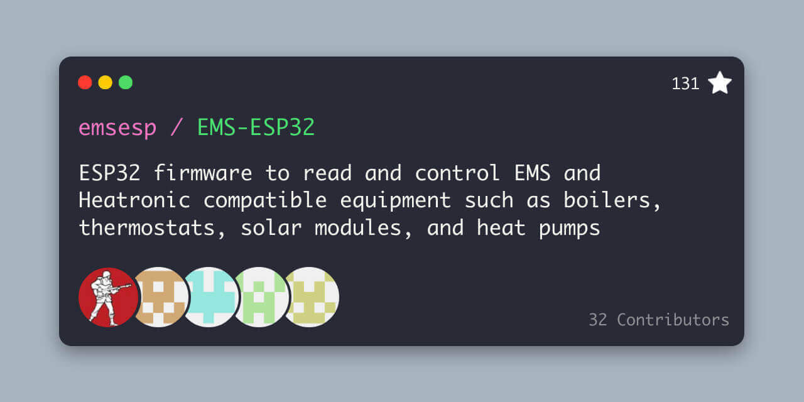
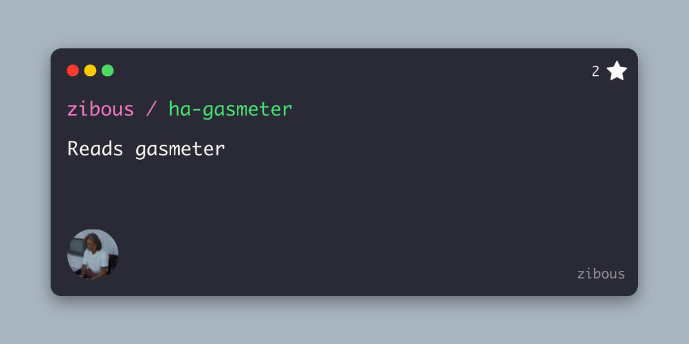
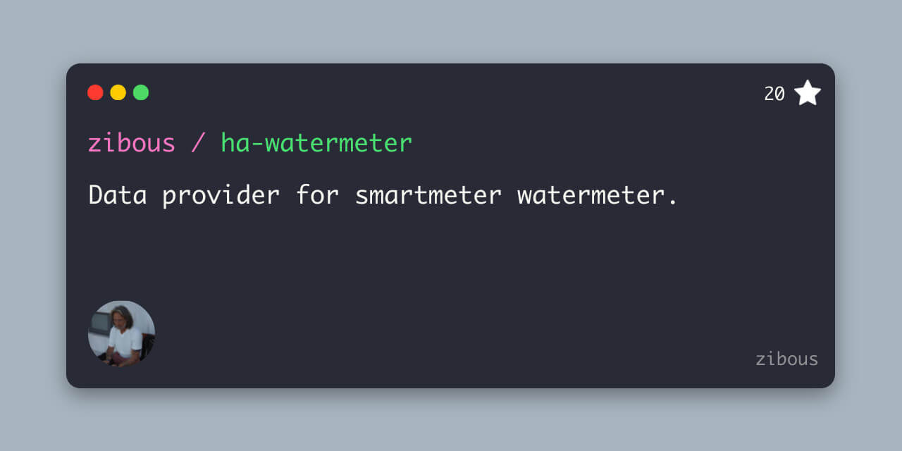

# Gasverbrauch Service Application

A Python application that reads the data from EMS-ESP and the gas meter, recalculates data. Transmits the results as an MQTT message for the Homeassisant application.


## Used devices - datasources
[](https://github.com/emsesp/EMS-ESP32)
[](https://github.com/zibous/ha-gasmeter) [](https://github.com/zibous/ha-watermeter)


## Dataprovider
With a simple HTTP request (aioesphomeapi was unstable and poorly documented. therefore switched to simple http request), the data from the gas meter is queried first and if the gas
consumption has changed compared to the previous query, then the data from the EMS-ESP32 is queried in a further HTTP request.
The gas consumption is then assigned according to the operating mode (heating, boiler)
and finally the consumption data is calculated

1. The fist dataprovider is the gasmeter ***ESP32 Device***.
  `http://gasmeter.local/text_sensor/gasmeterdata`

   <br>

    ```yaml
    text_sensor:
      - platform: template
        id: gasmeterdata
        update_interval: ${update_interval}
        lambda: |-
            char buf[512];
            sprintf(buf, "%.3f|%.3f|%s",
                  id(gas_meter_displayvalue),
                  id(gas_meter_totalm3),
                  id(systime).state.c_str()
                  );
            std::string s = buf;
            return s;
    ```
    <br>
    Data:

    ```python
        {
          "id":"text_sensor-gasmeterdata",
          "value":"29845.033|784.407|2022-03-29T16:52:20",
          "state":"29845.033|784.407|2022-03-29T16:52:20"
        }

        results = __espdata__(json)

        class __espdata__():
          """data values from the esp device"""
          displayvalue= -1.00
          totalvalue = 0.000
          timestamp = datetime.min
          def __init__(self, data: str = ''):
              """constructor espdata class"""
              if data:
                  items = data.split("|")
                  self.displayvalue = utils.fix_float(float(items[0]))
                  self.totalvalue = utils.fix_float(float(items[1]))
                  self.timestamp = items[2]


    ```
  2. The 2nd dataprovider is the ***EMS-ESP Device***
    `http://ems-heizung.lcoal/api/boiler`
     <br>
     data:
     ```json
        {
            "heatingactive": "off",
            "tapwateractive": "off",
            "selflowtemp": 5,
            "selburnpow": 0,
            "heatingpumpmod": 0,
            "outdoortemp": 17.6,
            "curflowtemp": 25.9,
            "burngas": "off",
            "burngas2": "off",
            "flamecurr": 0,
            "heatingpump": "off",
            "fanwork": "off",
            "ignwork": "off",
            "oilpreheat": "off",
            "heatingactivated": "on",
            "heatingtemp": 60,
            "pumpmodmax": 100,
            "pumpmodmin": 10,
            "pumpdelay": 5,
            "burnminperiod": 10,
            "burnminpower": 0,
            "burnmaxpower": 100,
            "boilhyston": -6,
            "boilhystoff": 6,
            "setflowtemp": 0,
            "setburnpow": 0,
            "curburnpow": 0,
            "burnstarts": 5617,
            "burnworkmin": 114284,
            "heatworkmin": 104157,
            "ubauptime": 421173,
            "lastcode": "0Y(276) 24.11.2021 03:51 (0 min)",
            "servicecode": "0H",
            "servicecodenumber": 203,
            "maintenancemessage": "H00",
            "maintenance": "date",
            "maintenancetime": 6000,
            "maintenancedate": "07.07.2023",
            "wwsettemp": 57,
            "wwseltemp": 57,
            "wwtype": "buffer",
            "wwcomfort": "eco",
            "wwflowtempoffset": 40,
            "wwmaxpower": 100,
            "wwcircpump": "off",
            "wwchargetype": "3-way valve",
            "wwhyston": -5,
            "wwhystoff": 0,
            "wwdisinfectiontemp": 70,
            "wwcircmode": "2x3min",
            "wwcirc": "off",
            "wwcurtemp": 53.8,
            "wwcurtemp2": 53.8,
            "wwcurflow": 0,
            "wwstoragetemp2": 53.8,
            "wwactivated": "on",
            "wwonetime": "off",
            "wwdisinfecting": "off",
            "wwcharging": "off",
            "wwrecharging": "off",
            "wwtempok": "on",
            "wwactive": "off",
            "ww3wayvalve": "off",
            "wwsetpumppower": 0,
            "wwstarts": 1106,
            "wwworkm": 10127
        }
     ```
     <br>
     used fields for the calculation:<br>

     `heatingactive, ww3wayvalve,
      tapwateractive, heatworkmin,
      wwworkm, servicecodenumber,
      wwdisinfecting, lastcode,
      espdata.totalvalue`
    <br>
## Results `Gasverbrauch Service Application`
- MQTT Message
  - Boiler (gas consumption / costs per hour, day, month, year )
  - Heating (gas consumption / costs per hour, day, month, year )

- GOTIFY Message
  - Monthly summary
  - Error Message
- DATA Report to CSV File
  - gas counter display value
  - gas consumption

- DATA TO Influxdb version 1.8.4
  - Boiler (gas consumption / costs per hour, day, month, year )
  - Heating (gas consumption / costs per hour, day, month, year )


## Installation

1. Clone the project
2. Install python requirements
3. Edit the properties for the configuration
4. Edit the default values
5. Set the permissions for the python application
6. Firs start


```bash
root@devhost:  git clone https://github.com/zibous/gasverbrauch.git /opt/gasverbrauch
root@devhost:  cd /opt/gasverbrauch
root@devhost:  sudo pip3 install -r requirements.txt
root@devhost:  cp conf_default.py  config.py
root@devhost:  nano config.py
root@devhost:  nano data/GB172BKG_default.json
root@devhost:  chmod +x app.py
root@devhost:  python3 app.py  ## or ./app.py
```


### Application settings
Strictly required: All variables must contain valid values:

| variable               | remarks                                 |
| ---------------------- | --------------------------------------- |
| APPS_DESCRIPTION       | Application short description           |
| APPS_NAME              | Application name                        |
| APPS_VERSION           | Application version                     |
| DATADIR                | Path to data folder                     |
| DATAFILE               | Data file gasmeter history              |
| REPORTFILE             | Optional report filename                |
| DATA_HOSTNAME          | Curren host name                        |
| DATA_PROVIDER          | Homeassistant provided by ...           |
| SMARTMETER_ID          | Internal used smartmeter identification |
| SMARTMETER_IDENTIFIER  | Homeassistant device name               |
| SMARTMETER_MANUFATURER | Homeassistant device manufacturer       |
| SMARTMETER_MODEL       | Homeassistant model name                |
| SMARTMETER_NAME        | Name of the smartmeter                  |
| SMARTMETER_DEVICE      | The smartmeter ESP Gasmeter device      |

### Date & Time settings
Strictly required: All variables must contain valid values:
|variable                              |remarks                        |
|--------------------------------------|-------------------------------|
|DATEFORMAT_CURRENT                    |2022-03-24 13:47:45.341981     |
|DATEFORMAT_DAY                        |2022-03-24                     |
|DATEFORMAT_HOUR                       |13                             |
|DATEFORMAT_MONTH                      |2022-03                        |
|DATEFORMAT_TIMESTAMP                  |2022-03-24T13:44:42            |
|DATEFORMAT_UTC                        |2022-03-24T13:47:45Z           |
|DATEFORMAT_YEAR                       |2022                           |
|DATE_DEFAULT                          |2022-03-24T13:47:44            |
|DATE_DEFAULT_MIN                      |1900-01-01T00:00:00            |
|DATE_LIST                             |List names for periodes        |
|DATE_NOW                              |2022-03-24 13:47:44.332083     |
|TIME_FORMAT                           |13:47:44                       |

### Data provider ESM-ESP Heater & ESP Gasmeter
Strictly required: All variables must contain valid values:
| variable                | remarks                                            |
| ----------------------- | -------------------------------------------------- |
| EMS_MODES               | internal: List for heating status                  |
| ESP32_API_DATA          | internal: EMS_ESP DATA                             |
| ESP32_GASMETER_FIELDS   | ESP32 Gas consumption dataprovider field name      |

### Homeassistant auto discovery (optional)
To turn this off, set `set GASMETER_HA_DISCOVERY_TOPIC = None` otherwise all variables must contain valid values.
| variable                    | remarks                                                 |
| --------------------------- | ------------------------------------------------------- |
| GASMETER_HA_DISCOVERY_ID    | ESP-Gasmeter                                            |
| GASMETER_HA_DISCOVERY_ITEMS | Filename for the logging discovery items data           |
| GASMETER_HA_DISCOVERY_SAVE  | If True the data for the discovery items will be saved. |
| GASMETER_HA_DISCOVERY_TOPIC | Homeassistant discovery topic (homeassistant)           |
| GASMETER_HA_ITEM_PREFIX     | Prefix for Homeassisant sensor name                     |
| GASMETER_HA_SECTION         | Topic section name for mqtt:  /gasdata/sensorname       |

### Gotify Messages (optional)
To turn this off, set `set GOTIFY_SERVICE = None` otherwise all variables must contain valid values.
| variable        | remarks                         |
| --------------- | ------------------------------- |
| EMS_ERROR_TEXT  | GOTIFY Title for error messages |
| GOTIFY_PRIORITY | GOTIFY Message priority         |
| GOTIFY_SERVICE  | GOTIFY Service url              |
| GOTIFY_TITLE    | GOTIFY Title for info messages  |
| GOTIFY_TOKEN    | GOTIFY Token                    |

### Influxdb (optional)
To turn this off, set `set INFLUXDB_HOST = None` otherwise all variables must contain valid values.
| variable             | remarks                                                    |
| -------------------- | ---------------------------------------------------------- |
| INFLUXDB_HOST        | Host or IP Address  Influxdb version 1.8.4  (influx.local) |
| INFLUXDB_LOG_DIR     | Optional logging folder for the influxdb messages (posts)  |
| INFLUXDB_NAME        | Database name Influxdb version 1.8.4                       |
| GASMETER_MEASUREMENT | Influxdb version 1.8.4 Measurement name                    |
| INFLUXDB_PASSWORD    | Influxdb version 1.8.4 User Password                       |
| INFLUXDB_PORT        | Influxdb version 1.8.4 Port                                |
| INFLUXDB_USER        | Influxdb version 1.8.4 Username                            |

### Logging
If `LOG_DIR=None` no logfiles will be uses, only messages based on the LOG_LEVEL
will be send to the console or syslog.
|variable                              |remarks                        |
|--------------------------------------|-------------------------------|
|LOG_DIR                               |disabled LOG_DIR = None        |
|LOG_LEVEL                             |Loglevel settings              |
|LOG_SHOWLINES                         |shows method and line numbers  |

### Mqtt Brocker (optional)
To turn this off, set `set MQTTHOST = None` otherwise all variables must contain valid values.
| variable                   | remarks                             |
| -------------------------- | ----------------------------------- |
| MQTTAUTH                   | Mqtt Brocker User and Password      |
| MQTTCLIENT                 | Name for this device                |
| MQTTHOST                   | Hostname or IP Address Mqtt Brocker |
| MQTTPORT                   | Port Mqtt Brocker                   |
| MQTTTOPIC                  | Default Topic for the Mqtt Brocker  |
| MQTT_BASETOPIC             | Base Topic Mqtt Brocker             |
| MQTT_CHECK_HEARTBEAT_TOPIC | Heartbeat Topic Mqtt Brocker        |
| MQTT_CHECK_LWT_TOPIC       | Last Will (LWT) check topic         |
| MQTT_LWT_TOPIC             | Last Will (LWT) check topic         |


### Cost calculation (optinal)
To turn this off, set `set COST_CALCULATION_ON = False` otherwise all variables must contain valid values.
|variable                              |remarks                        |
|--------------------------------------|-------------------------------|
|COST_CALCULATION_ON                   |Optional: False = not used     |
|COST_CALCULATION                      |Optional                       |


## Files and Folders
 - conf.py
   Application settings
 - app.py
   Application
 - lib
   Python3 lib directiory
 - data
   data folder, holds default, histroy and report data
 - log
   log folder

## Requirements
 - python 3.9 (min)
 - influxdb==5.3.1
 - paho_mqtt==1.6.1
 - requests==2.25.1
 - importlib_metadata
 - uptime==3.0.1

## Continuous Daemon/Service
You most probably want to execute the program continuously in the background. This can be done either by using the internal daemon or cron.
Attention: Daemon mode must be enabled in the configuration file (default) - Systemd service - on systemd powered systems the recommended option

```bash
    root@devhost: sudo cp /opt/gasverbrauch/service.template \
                         /etc/systemd/system/gasverbrauch.service
    root@devhost: sudo systemctl daemon-reload
    root@devhost: sudo systemctl start gasverbrauch.service
    root@devhost: sudo systemctl status gasverbrauch.service
    root@devhost: sudo systemctl enable gasverbrauch.service
    ## or
    root@devhost: bash install_service.sh
```

## Fields
|name                                  |field                          |type         |
|--------------------------------------|-------------------------------|-------------|
|Heizkreis                             |heater_active                  |binary_sensor|
|Warmwasserboiler                      |boiler_active                  |binary_sensor|
|Boiler desinfizieren                  |boiler_disinfecting            |binary_sensor|
|Boiler desinfizieren Start            |boiler_disinfecting_start      |sensor       |
|Boiler desinfizieren Ende             |boiler_disinfecting_end        |sensor       |
|Boiler desinfizieren Zeit             |boiler_disinfecting_sec        |sensor       |
|Betriebsdauer                         |runnig_total_sec               |sensor       |
|Betriebsdauer Heizkreis               |runnig_heater_sec              |sensor       |
|Betriebsdauer Boiler                  |runnig_boiler_sec              |sensor       |
|Heizkreis Anteil                      |runnig_heater_ratio            |sensor       |
|Boiler Anteil                         |runnig_boiler_ratio            |sensor       |
|Gasverbrauch gesamt                   |gas_total                      |sensor       |
|Gasverbrauch Heizkreis gesamt         |gas_heater                     |sensor       |
|Gasverbrauch Boiler gesamt            |gas_boiler                     |sensor       |
|Gasverbrauch Boiler aktuell           |gasverbrauch_boiler            |sensor       |
|Gasverbrauch Heizkreis aktuell        |gasverbrauch_heater            |sensor       |
|Messzeit                              |elapsed_time                   |sensor       |
|Gas Boiler pro Stunde                 |gas_per_hour.boiler            |sensor       |
|Gas Heizkreis pro Stunde              |gas_per_hour.heater            |sensor       |
|Gas Boilerdesinfizierung pro Stunde   |gas_per_hour.disinfecting      |sensor       |
|Gas Boiler pro Tag                    |gas_per_day.boiler             |sensor       |
|Gas Heizkreis pro Tag                 |gas_per_day.heater             |sensor       |
|Gas Boilerdesinfizierung pro Tag      |gas_per_day.disinfecting       |sensor       |
|Gas Boiler pro Monat                  |gas_per_month.boiler           |sensor       |
|Gas Heizkreis pro Monat               |gas_per_month.heater           |sensor       |
|Gas Boilerdesinfizierung pro Monat    |gas_per_month.disinfecting     |sensor       |
|Gas Boiler pro Jahr                   |gas_per_year.boiler            |sensor       |
|Gas Heizkreis pro Jahr                |gas_per_year.heater            |sensor       |
|Gas Boilerdesinfizierung pro Jahr     |gas_per_year.disinfecting      |sensor       |
|Kosten Boiler pro Stunde              |cost_gas_per_hour.boiler       |sensor       |
|Kosten Heizung pro Stunde             |cost_gas_per_hour.heater       |sensor       |
|Kosten Boilerdesinfizierung pro Stunde|cost_gas_per_hour.disinfecting |sensor       |
|Kosten Boiler pro Tag                 |cost_gas_per_day.boiler        |sensor       |
|Kosten Heizung pro Tag                |cost_gas_per_day.heater        |sensor       |
|Kosten Boilerdesinfizierung pro Tag   |cost_gas_per_day.disinfecting  |sensor       |
|Kosten Boiler pro Monat               |cost_gas_per_month.boiler      |sensor       |
|Kosten Heizung pro Monat              |cost_gas_per_month.heater      |sensor       |
|Kosten Boilerdesinfizierung pro Monat |cost_gas_per_month.disinfecting|sensor       |
|Kosten Boiler pro Jahr                |cost_gas_per_year.boiler       |sensor       |
|Kosten Heizung pro Jahr               |cost_gas_per_year.heater       |sensor       |
|Kosten Boilerdesinfizierung pro Jahr  |cost_gas_per_year.disinfecting |sensor       |
|Gasverbrauch aktualisiert             |dattimestamp                   |sensor       |

<hr>

## Developer Helper - Create requirements.txt
```bash
  root@devhost: bash make_req.sh
```


## Credits
marc1de:   https://github.com/marc1de

EMS-ESP32: https://github.com/emsesp/EMS-ESP32/issues/399

EMS-ESP:   https://bbqkees-electronics.nl
