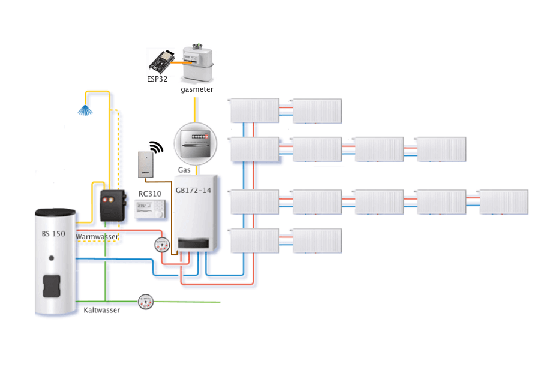

# Gasverbrauch Service Application

A Python application that reads the data from EMS-ESP and the gas meter, recalculates data. Transmits the results as an MQTT message for the Homeassisant application.



## Results
- MQTT Message
  - Boiler (gas consumption / costs per hour, day, month, year )
  - Heating (gas consumption / costs per hour, day, month, year )

- GOTIFY Message
  - Monthly summary
  - Error Message
- DATA Report to CSV File
  - gas counter display value
  - gas consumption


## Installation

1. Clone the project 
2. Install python requirements
3. Edit the properties for the configuration
4. Edit the default values 
5. Set the permissions for the python application
6. Firs start


```bash
root@devhost:  git clone https://github.com/zibous/gasverbrauch.git /opt/gasverbrauch
root@devhost:  cd /opt/gasverbrauch
root@devhost:  sudo pip3 install -r requirements.txt
root@devhost:  cp conf_default.py  config.py
root@devhost:  nano config.py
root@devhost:  nano data/gb172_default.json
root@devhost:  chmod +x app.py
root@devhost:  python3 app.py  ## or ./app.py
```

## Files and Folders
 - conf.py
   Application settings
 - app.py
   Application
 - lib
   Python3 lib directiory
 - data
   data folder, holds default, histroy and report data
 - log
   log folder

## Requirements
 - python 3.9 (min)
 - aioesphomeapi==10.8.2
 - influxdb==5.3.1
 - paho_mqtt==1.6.1
 - requests==2.25.1
 - unicode_slugify==0.1.5
 - uptime==3.0.1


## Continuous Daemon/Service
You most probably want to execute the program continuously in the background. This can be done either by using the internal daemon or cron.
Attention: Daemon mode must be enabled in the configuration file (default) - Systemd service - on systemd powered systems the recommended option

```bash
    root@devhost: sudo cp /opt/gasverbrauch/service.template /etc/systemd/system/gasverbrauch.service
    root@devhost: sudo systemctl daemon-reload
    root@devhost: sudo systemctl start gasverbrauch.service
    root@devhost: sudo systemctl status gasverbrauch.service
    root@devhost: sudo systemctl enable gasverbrauch.service
```

## Developer Helper - Create requirements.txt
```bash
  root@devhost: bash make_req.sh
```


## Credits
marc1de:   https://github.com/marc1de

EMS-ESP32: https://github.com/emsesp/EMS-ESP32/issues/399

EMS-ESP:   https://bbqkees-electronics.nl
